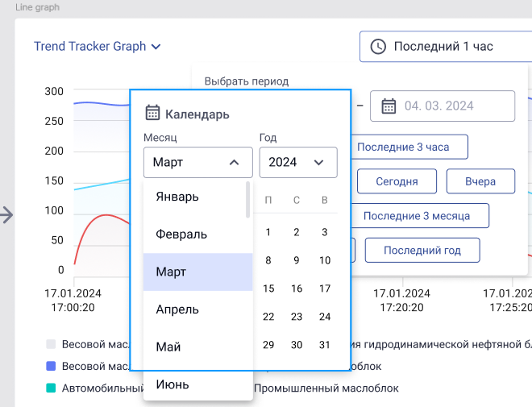

# Пример кода

## Задача
Реализовать компонент для фильтрации данных.

## Макет

## Дополнения к макету

- [ ] Макет
  - [ ] строка даты
    - [ ] добавить кнопку Очистить
  - [ ] строка с кнопками Вчера Сегодня
  - [ ] строка - 
    - [ ] кнопка Последние, 
    - [ ] инпут числа (кол-во), 
    - [ ] выпадайка единиц измерения от секунды до года

- [ ] Поведение
  - [ ] кнопки строк Вчера/Сегодня и Последний взаимоисключаемые и залипающие, то есть, 
    - [ ] если нажимаем Сегодня, то она включается и другие выключаются
    - [ ] если нажимаем Вчера, то она включается и другие выключаются
    - [ ] если нажимаем Последний, то кнопки Вчера и Сегодня выключатся
  - [ ] диапазон дат будет работать только при выключенных всех кнопках строк Вчера/Сегодня и Последний
